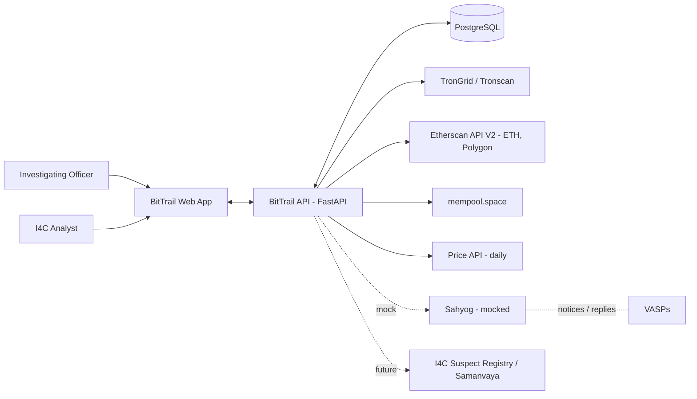
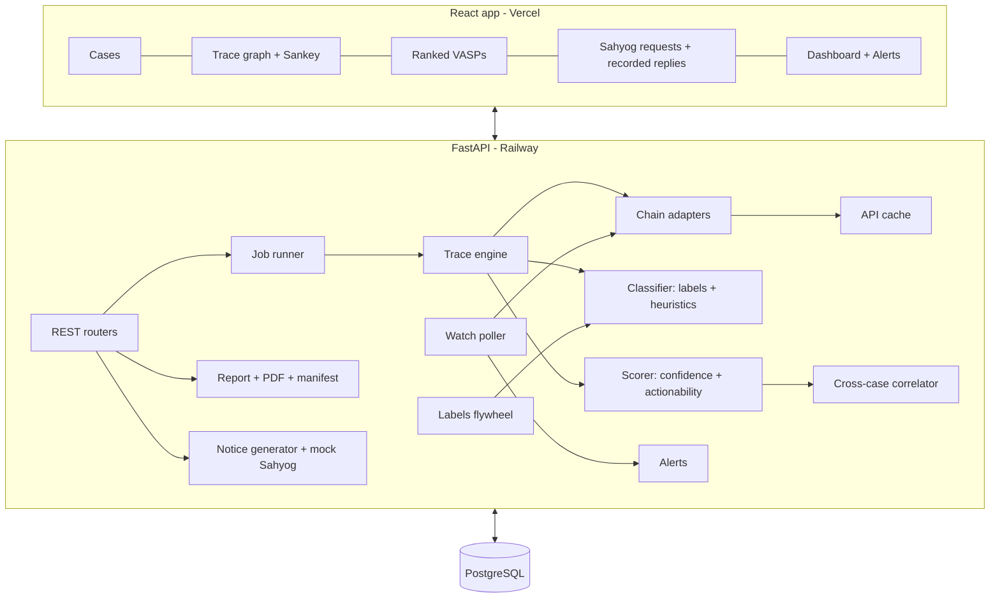

# BitTrail — Architecture

Status: Draft v0.1 · MVP prototype. See [prd.md](prd.md) for scope, [schema.md](schema.md) for data, [phases.md](phases.md) for the build plan.

---

## 1. System context



## 2. Components



| Module | Responsibility |
|---|---|
| `routers/` | REST endpoints (section 6) |
| `jobs/` | Trace job lifecycle: `queued → running → done / failed`, stored in `trace_jobs`, run via FastAPI background tasks |
| `adapters/` | One file per chain family; each implements the adapter interface (section 3) |
| `cache/` | Read-through cache on `api_cache`, keyed by the request's signature; demo mode = cache only |
| `engine/trace.py` | Forward and backward breadth-first search, limits, tracking how value splits |
| `engine/classify.py` | Label lookup + deposit-sweep rule + service / mixer / bridge detection |
| `engine/score.py` | Noisy-OR confidence, actionability, ranking |
| `engine/crosscase.py` | Index addresses → cases; emit links |
| `labels/` | Loaders for curated sources + `vasp_registry.json`; flywheel updates |
| `reports/` | Jinja2 HTML → WeasyPrint PDF; SHA-256 manifest |
| `notices/` | Section 94 BNSS / freeze notice templates; mock Sahyog send and VASP reply |
| `watch/` | Poller (every 5 min) over `watch_items`; creates `alerts` |
| `audit/` | Append-only `audit_log` writer used by every mutating action |

## 3. Chain adapter interface

Every adapter returns normalised `Transfer` records (see [schema.md §3](schema.md#3-core-domain-objects-json)).

```python
class ChainAdapter(Protocol):
    chain: Chain                      # "tron" | "ethereum" | "polygon" | "bitcoin"
    def detect(self, address: str) -> bool: ...
    async def get_transfers(
        self, address: str, direction: Literal["out", "in"],
        since: datetime | None, until: datetime | None, limit: int = 200
    ) -> list[Transfer]: ...
    async def get_address_stats(self, address: str) -> AddressStats: ...   # tx_count, first/last seen, counterparties
    async def get_tags(self, address: str) -> list[ExternalTag]: ...        # e.g. Tronscan tag; [] if unsupported
```

| Chain | Source | Calls used | Notes |
|---|---|---|---|
| Tron | TronGrid, Tronscan | TRC-20 transfers per account, TRX transactions, account tags | Main chain for USDT. API key in env. |
| Ethereum / Polygon | Etherscan API V2 (`chainid=1` / `137`) | `tokentx`, `txlist` | One key for both. BNB Chain is not on the free tier. |
| Bitcoin | mempool.space | `/api/address/{a}/txs`, `/api/tx/{txid}` | MVP follows outputs by value; no change detection. |

**Address → chain detection:** `^T[1-9A-HJ-NP-Za-km-z]{33}$` → tron · `^0x[0-9a-fA-F]{40}$` → EVM (the user picks ETH or Polygon; default ETH) · `^(bc1|[13])` → bitcoin.

**Valuing transfers in USD:** USDT/USDC = 1.0. Native assets use a daily close from the price API, cached in `prices`.

## 4. Trace engine

### 4.1 Forward trace

```
input: seeds (case wallets), fraud_time, params
queue ← seeds with value_share = 1.0 / len(seeds)
while queue and edges < MAX_EDGES:
    node ← pop (breadth-first)
    if depth(node) ≥ MAX_DEPTH or node is terminal: continue
    outs ← adapter.get_transfers(node, "out", since = node.first_inflow_time or fraud_time,
                                  until = since + WINDOW)
    outs ← drop amount_usd < MIN_USD; keep top FANOUT by amount_usd
    total ← Σ outs.amount_usd
    for t in outs:
        child.value_share += node.value_share × (t.amount_usd / total)   # proportional split
        add edge(node → child, t)
        classify(child) → if terminal (VASP deposit / hot wallet, mixer, bridge, sanctioned): mark, don't expand
        else enqueue(child)
```

| Parameter | Default | Env var |
|---|---|---|
| MAX_DEPTH | 5 | `TRACE_MAX_DEPTH` |
| FANOUT | 5 | `TRACE_FANOUT` |
| MIN_USD | 10 | `TRACE_MIN_USD` |
| MAX_EDGES | 2000 | `TRACE_MAX_EDGES` |
| WINDOW | 90 days | `TRACE_WINDOW_DAYS` |
| BACKWARD_DEPTH | 2 | `TRACE_BACK_DEPTH` |

### 4.2 Backward trace (on-ramp)
Same loop using `direction="in"` from the seeds, before `fraud_time`, depth 2, with no value split. Any labelled VASP found becomes a candidate with `role = "on_ramp"`.

### 4.3 Classification rules (in order; first match wins)

| # | Rule | Result |
|---|---|---|
| 1 | Address in `labels` with type `mixer` | `mixer` → **terminal, stop** |
| 2 | In `labels` with type `bridge` | `bridge` → terminal (MVP) |
| 3 | In `labels` with type `sanctioned` | flag `sanctioned`; keep expanding |
| 4 | In `labels` with type `vasp_hot` / `vasp_cold` / `vasp_deposit` | VASP node → **terminal** |
| 5 | **Deposit-sweep:** ≥ 90% of outflow USD goes to one address labelled `vasp_hot`, ≤ 3 distinct outgoing counterparties, first sweep ≤ 24 h after the traced funds arrived | `vasp_deposit` (inferred) of that VASP → terminal |
| 6 | **Service-like** (on the adapter's sample of the latest ≤ 200 transfers): ≥ 60 distinct recipients, or a full 200-transfer page within 3 days | `unknown_service` → terminal, flagged "possible unlabelled VASP" |
| 7 | Known P2P / fintech off-ramp (curated list) | `offramp` → terminal |
| 8 | Otherwise | `intermediary` → expand |

Thresholds live in `config/heuristics.yaml`.

### 4.4 Scoring

For each candidate VASP `v` (deduplicated by VASP entity), with evidence signals `sᵢ ∈ [0,1]` and weights `wᵢ`:

```
confidence(v) = path_factor × (1 − Π (1 − wᵢ · sᵢ))
```

| Signal | sᵢ | wᵢ |
|---|---|---|
| Label source tier | verified (flywheel) 1.0 · exchange-published / proof-of-reserves 0.95 · curated dump 0.8 · community 0.6 | 0.9 |
| Deposit-sweep match | fraction of outflow to that VASP's hot wallet | 0.7 |
| External tag agrees (e.g. Tronscan) | 1 / 0 | 0.5 |
| Value share reaching `v` | value_share | 0.4 |
| Recency | 1 if the last hop is < 7 days after the fraud, decaying to 0 at 90 days | 0.2 |

`path_factor`: 1.0 for a clean path · 0.7 if a bridge is on the path · 0 through a mixer.

**Actionability `a(v)`** (from `vasps`): FIU-IND registered and on Sahyog = 1.0 · FIU-IND registered only = 0.9 (an Indian reporting entity, so a Section 94 BNSS notice applies) · on Sahyog only = 0.85 · foreign VASP with a law-enforcement portal = 0.6 · unknown = 0.3.

**Rank score** = `value_share × confidence × a(v)`. The UI always shows all three components and the reasons.

**Freeze window:** for a `vasp_deposit` candidate, if its current balance is > 0 → "funds still at deposit address"; if already swept → "swept to hot wallet at `<time>`".

### 4.5 Cross-case correlation
After scoring, upsert every `vasp_deposit`, `offramp` and intermediary with value_share ≥ 0.05 into `address_case_index`. If the same (chain, address) belongs to another case → create a `case_links` row and alert both cases.

### 4.6 Labels flywheel
When a VASP reply says `confirmed` → upsert a `labels` row (`source='vasp_confirmation'`, `tier='verified'`) → re-score open cases that contain that address. `denied` → store a negative label and down-weight it.

### 4.7 Watch poller
Every 5 minutes: for each active `watch_items` row, fetch outgoing transfers since `last_checked_at`; any new transfer → `alerts` row (`severity` = high if the receiver is a VASP).

## 5. Reports and evidence

- PDF rendered with **fpdf2** (pure Python; no system libraries, so it deploys anywhere). The on-screen view is the case workspace itself.
- **Manifest:** a canonical JSON (sorted keys) of `{case, trace_params, block_heights_or_timestamps, edges[tx_hash…], candidates, generated_at}`. `sha256(manifest)` is printed on every PDF page and stored in `reports`.
- Includes a Section 63 Bharatiya Sakshya Adhiniyam (BSA) certificate template (placeholders for the officer to complete).

## 6. REST API (v1)

| Method | Path | Purpose |
|---|---|---|
| POST | `/api/v1/cases` | Create a case (+ wallets) |
| GET | `/api/v1/cases` · `/api/v1/cases/{id}` | List / detail |
| POST | `/api/v1/cases/{id}/trace` | Start a trace job → `{job_id}` |
| GET | `/api/v1/jobs/{job_id}` | Status + progress |
| GET | `/api/v1/cases/{id}/graph` | Nodes + edges (Cytoscape format) |
| POST | `/api/v1/cases/{id}/reports` · GET `/api/v1/cases/{id}/reports` | Generate (→ `{id, sha256}`) / list reports |
| GET | `/api/v1/reports/{id}.pdf` · `/api/v1/reports/{id}/manifest` | PDF · manifest with stored and recomputed hash |
| POST | `/api/v1/cases/{id}/requests` | Draft a notice for a candidate VASP |
| POST | `/api/v1/requests/{id}/send` | Mock "send via Sahyog" |
| GET | `/api/v1/requests` | IO / analyst: all requests |
| POST | `/api/v1/requests/{id}/reply` | Officer records the VASP's reply received on Sahyog (confirmed / denied) → flywheel |
| POST | `/api/v1/sahyog/reply` | **Integration stub:** Sahyog pushes a VASP reply, matched by `sahyog_ref` (analyst role) → flywheel |
| GET | `/api/v1/alerts` · POST `/api/v1/alerts/{id}/read` | Alert feed |
| GET | `/api/v1/cases/{id}/watch` · POST `/api/v1/watch/{id}/check` | Watch items / force a check |
| GET | `/api/v1/stats` · `/api/v1/vasps` | Dashboard numbers · VASP registry |
| POST | `/api/v1/sahyog/webhook` | **Integration stub:** Sahyog pushes a case (analyst role) |
| GET | `/api/v1/health` | Health, label count, enabled chains, cache mode |

Candidates, links and alerts are returned inside `GET /api/v1/cases/{id}` (one round-trip for the workspace).

Auth (MVP): `POST /api/v1/auth/login` with seeded users per role → JWT; `GET /api/v1/auth/demo-users` powers the one-click demo login; roles `io`, `analyst`. VASPs are not BitTrail users; they act on Sahyog.

## 7. Frontend (routes)

| Route | Screen |
|---|---|
| `/login` | Role login (demo users) |
| `/` | Dashboard: stats, recent cases, alerts |
| `/cases/new` | Case intake form |
| `/cases` | Case list with nearest VASP and link counts |
| `/cases/:id` | Case workspace: **graph** (Cytoscape) with node inspector · Sankey tab · transactions tab · **ranked VASPs** panel · linked-case and freeze-window banners · reports (PDF + hash) · notice drafting |
| `/requests` | IO: drafted and sent notices · record the VASP's Sahyog reply (confirmed / denied) |
| `/alerts` | Alert feed |

Graph legend: orange = suspect · grey = intermediary · teal = VASP · navy = hot wallet · red dashed = mixer · purple = bridge. Edge width ∝ value_share.

## 8. Repository layout

```
(repo root)
  backend/
    app/
      main.py  config.py  db.py  models.py  auth.py  audit.py  jobs.py  crosscase.py
      routers/  (cases.py, reports.py, requests.py [incl. flywheel], misc.py [auth, alerts, watch, stats, health, sahyog])
      adapters/ (base.py, http.py [cache + rate limit], prices.py, tron.py, evm.py, btc.py)
      engine/   (model.py, trace.py, classify.py, score.py)   ← pure, unit-tested, no DB
      labels/   (index.py, registry.py, seed.py)
      reports/  (manifest.py, pdf.py)
      notices/  (templates.py)
      watch/poller.py
    config/heuristics.yaml
    data/ (vasp_registry.json, demo_cases.json, demo_cache.json.gz, label_seeds/*.csv)
    scripts/ (fetch_label_sources.py, trace_cli.py, smoke_test.py, export_demo_cache.py)
    tests/test_engine.py
  frontend/src/ (pages/, components/graph/, components/sankey/, api/, store/)
  docs/  Dockerfile  railway.json  docker-compose.yml  .env.example  README.md  CONTEXT.md
```

Schema is created with `create_all` on startup (no Alembic migrations in v0.1). Labels are seeded in committed batches of 1,000 (resume-safe; poolers drop very large statements).

## 9. Deployment

| Piece | Where | Notes |
|---|---|---|
| App (API + built frontend) | **Railway**, one service from the root `Dockerfile` | FastAPI serves `frontend/dist` at `/`; the poller runs in-process. Health check `/api/v1/health`. |
| Database | **Supabase Postgres**, via the IPv4 **session pooler** (`aws-0-<region>.pooler.supabase.com:5432`) | The direct host is IPv6-only; the transaction pooler (`:6543`) is also supported (prepared statements disabled automatically). |
| Local | `uvicorn` + `npm run dev` (SQLite if `DATABASE_URL` unset) or `docker compose up` | `DEMO_MODE=true` = cache-only, fully offline |

**Environment:** `DATABASE_URL`, `JWT_SECRET`, `TRONGRID_API_KEY` (optional), `ETHERSCAN_API_KEY` (optional: ETH/Polygon fall back to Blockscout), `ETHERSCAN_BSC` / `BSC_API_BASE` (BNB Chain), `SOLANA_RPC_URL`, `BRIDGE_TRACKER`, `CROSSCHAIN_PROVIDERS`, `THORCHAIN_MIDGARD_URL`, `NEO4J_URI` (optional), `SARVAM_API_KEY` (optional), `DEMO_MODE`, `TRACE_*`, `WATCH_INTERVAL_SECONDS`, `CORS_ORIGINS`, `FRONTEND_DIST`. Prices come from Binance public daily klines (cached), with no key needed.

## 10. Technology choices

| Choice | Why | Revisit when |
|---|---|---|
| NetworkX in memory; Neo4j as an optional mirror / export | Traces are small and bounded; no extra infrastructure by default | Cross-case graph analytics at scale (set `NEO4J_URI`) |
| Background tasks, not Celery | One process, simple deploy | More than a few concurrent traces |
| PostgreSQL for everything | Relational cases + JSONB for raw data | Bulk history (ClickHouse / BigQuery) |
| Rules before ML | Explainable, fast to build, defensible in court | Once enough verified labels exist → GraphSAGE |
| Mock Sahyog | No access to the real API | During an I4C pilot |

## 11. Security and compliance (prototype level)

- Role-based access on routes (`io`, `analyst`).
- **Supabase lockdown:** on startup every table gets Row Level Security enabled with no policies (`db.lock_down_public_api`). That blocks Supabase's public REST API (publishable / anon key) from all BitTrail data. The backend connects as `postgres`, which bypasses RLS, so the app is unaffected.
- Every create, update, send or reply writes to `audit_log` (append-only; no updates or deletes via the API).
- No real personal data. Case metadata in demos is fictional; wallet addresses are public on-chain data.
- Target production: on-prem at I4C / NIC; LLM served locally; data never leaves government infrastructure.

## 12. v0.2 additions

| Area | What | Where |
|---|---|---|
| Explainable scoring | Noisy-OR confidence split into additive factor points: `points_i = C × (−ln(1 − wᵢsᵢ)) / Σ(−ln(1 − wⱼsⱼ)) × 100` (sums exactly to C × 100). What-if scenarios recomputed from stored signals. "Why A not B" = factor-by-factor gap. | `engine/explain.py`, `Candidate.explain` |
| Investigation memory | `history` factor (weight 0.5): 1.0 if the VASP confirmed the address earlier, else 0.6 + 0.15·(n−1) for n earlier cases attributing it to the same VASP. A later case linking to an earlier one updates the earlier case's risk profile. | `jobs.make_history`, `jobs._refresh_peer_risk` |
| Exchange cluster | > 3 counterparties and ≥ 60% of outflow to one exchange's labelled wallets → `vasp_hot` (inferred) | `engine/classify.py` |
| Chains | BNB Chain (`bsc`, Etherscan V2 chainid 56 or `BSC_API_BASE`), Solana (JSON-RPC; owner + USDT/USDC token accounts; SOL via system transfers, SPL via per-owner balance deltas) | `adapters/evm.py`, `adapters/solana.py` |
| Cross-chain | A transfer into a labelled bridge → LI.FI status lookup → destination tx on the other chain → continuity score (amount 0.35, time 0.25, tracker confirmation 0.3, destination 0.1) → trace continues on the destination chain; path factor 0.5 + 0.5·continuity | `adapters/bridges.py`, `engine/trace._cross_chain` |
| Typologies + risk | Splitting, consolidation, rapid movement, multi-hop layering, repeated forwarding, network switching, mixer, sanctions; six risk axes (velocity, layering, cross-chain, proliferation, VASP exposure, historical linkage) → overall + level | `engine/typology.py`, `TraceJob.analysis` |
| Integrity | Engine version, ruleset SHA-256, labels loaded, data sources per chain, block/time ranges, counts, `llm_used_for_attribution: false` in every manifest | `jobs.integrity`, `reports/manifest.py` (schema v2) |
| Timeline + replay | On-chain edges + trace runs + alerts + reports + notices + replies in time order; replay reveals edges in timestamp order | `timeline.py`, `GET /cases/{id}/timeline`, `CaseDetail` |
| Alerts | Rules in the `settings` table (`GET/PUT /settings/alerts`): large transfer, new activity, score increase, new relationship, risk patterns (min level). Suspect wallets are watched too; `POST /cases/{id}/monitor` toggles a case. | `alert_rules.py`, `watch/poller.py` |
| Requests | `consolidate: true` → one notice listing every linked case sharing the address / VASP | `routers/requests.py`, `notices/templates.py` |
| Sarvam AI | `POST /cases/{id}/narrative` (en-IN / hi-IN; template fallback), `POST /cases/{id}/ask`, `POST /requests/{id}/translate`, `GET /ai/status`. Prompts contain only `llm.case_facts()`; outputs labelled AI-written; every call audited. | `llm.py`, `routers/insights.py` |
| Migrations | `db.add_missing_columns()` adds new nullable columns on existing databases at startup | `db.py` |
| Accuracy test | Label-ablation hide-and-seek on live Tron data | `scripts/eval_hide_and_seek.py` → `docs/eval.md` |

## 13. v0.3 additions (multi-chain and cross-chain by default)

| Area | What | Where |
|---|---|---|
| Keyless chains | Ethereum / Polygon fall back to the Blockscout public API (Etherscan-compatible) when `ETHERSCAN_API_KEY` is unset. Tron (TronGrid), Bitcoin (mempool.space), Solana (public RPC) need no key. BNB Chain needs a paid Etherscan key (`ETHERSCAN_BSC=1`) or `BSC_API_BASE`: free BNB RPCs refuse historical log queries. `GET /health` → `chain_sources` says which source each chain uses. | `adapters/evm.py`, `adapters/__init__.chain_status` |
| Multi-chain seeds | An EVM suspect address is probed on every EVM chain; each chain where it sent funds after the fraud becomes a seed. Seeds are weighted by what they sent (not split equally). | `engine/trace._expand_seeds` |
| Cross-chain resolver | By source tx hash: LI.FI status (Tron 728126428, Bitcoin 20000000000001, EVM, Solana), THORChain Midgard (`THORCHAIN_MIDGARD_URL`), deBridge DLN, Wormholescan. Providers per source chain run concurrently; 404 "unknown tx" answers are cached (`cached_get(ok_status=...)`). | `adapters/bridges.py` |
| Proactive bridge detection | Every new unlabelled recipient carrying ≥ 1% of traced value (`crosschain_probe.min_share`) is checked against the trackers before its own outflow is followed, so bridge vaults (THORChain), deposit addresses (Layerswap) and routers that look like wallets are not followed into other people's money. A hit turns the node into `bridge` / `swap_service` (label source `bridge_tracker:<provider>`, tier `published`). Service-like and "holds funds" wallets are re-checked after classification. | `engine/trace._probe`, `_cross_chain` |
| Unconfirmed fallback | For labelled bridges with no tracker record only: same EVM address on another EVM chain receiving the value less ≤ 3% within 6 h → hop with `confirmed=false` (continuity ≤ 0.7) | `bridges.same_address_match` |
| Swap services | New kind `swap_service` (THORChain etc.): treated like a bridge for path factor, typologies and graph | `classify.py`, `score.py`, `typology.py` |
| Adaptive dust filter | Per wallet, ignore transfers below `max(TRACE_MIN_USD, 0.5% × value reaching it)` (cap $1,000); sub-$1 transfers counted as address-poisoning; if the ignored transfers carry ≥ 20% of outflow the floor drops back (structuring flag) | `engine/trace._dust_floor`, `heuristics.yaml: dust` |
| CoinJoin | Bitcoin txs with ≥ 5 inputs and ≥ 5 equal outputs (≥ 40% of outputs) are tagged `coinjoin` by the adapter; the engine adds a `mixer` node (`heuristic:coinjoin`) and stops | `adapters/btc.is_coinjoin`, `trace._coinjoin` |
| Risk categories | OFAC labels now come from the official SDN XML with entity name and programs; programs map to plain categories (CYBER → cybercrime / ransomware, SDGT / FTO → terrorism financing, DPRK, narcotics, TCO, sanctions evasion, Iran, darknet market by SDN name). A critical category sets risk level critical and raises a `high_risk_wallet` alert. | `labels/risk.py`, `scripts/fetch_label_sources.py` |
| Parallel fetch | The HTTP rate-limit lock spaces request starts only; each BFS level, the backward trace and Solana transaction parsing fetch concurrently | `adapters/http.py`, `trace._prefetch` |
| Routing | `labels/registry.route()`: Sahyog (onboarded) → Sahyog notice to the nodal officer (FIU-IND registered) → the VASP's LE portal → MLAT (MHA) / Interpol (CBI). Registry rebuilt from cited sources (Lok Sabha Q.5805 annexure, Delhi HC order of 29 Apr 2025, exchanges' LE pages). Stored on `Request.route`; the notice header follows the channel. | `labels/registry.py`, `data/vasp_registry.json` |
| Officer review | An IO's request on a candidate with confidence < 0.7 (`requests.approval_below_confidence`) is `pending_approval` until an analyst calls `POST /requests/{id}/approve` | `routers/requests.py` |
| RAG | "Ask this case" = BM25 over passages built from the case's own computed evidence (candidates, addresses + reasons, transfers, cross-chain hops, risk, patterns, links, requests, alerts) plus `data/kb.md` (law / method notes). Sarvam answers from the top passages with [n] citations; without a key the passages themselves are returned. | `rag.py`, `POST /cases/{id}/ask` |
| Live alerts | `GET /alerts/stream?token=` (server-sent events) pushes new alerts within ~2 s; watch poller every 120 s | `routers/misc.alert_stream`, `Layout.tsx` |
| Audit | `GET /audit` and `GET /audit/verify` (analyst only) recompute the SHA-256 chain | `routers/misc.py`, `pages/Audit.tsx` |
| Graph export / Neo4j | `GET /cases/{id}/graph/export?format=graphml|cypher|json`; optional mirror into Neo4j after each trace when `NEO4J_URI` is set (Postgres stays the system of record) | `graphstore.py` |
| UI | Graph swimlanes (one lane per chain, bridge hops cross lanes, labelled with tool + continuity); cross-chain hop panel with continuity breakdown; chain chips; multi-chain coverage on the dashboard | `TraceGraph.tsx`, `CrossChain.tsx` |
