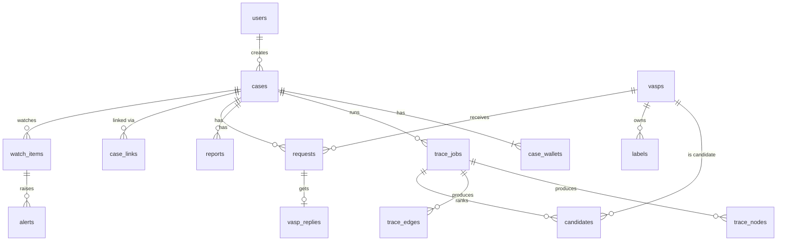

# BitTrail — Data Schema

Status: Draft v0.1 · PostgreSQL 16 (SQLite-compatible types where possible for local dev).
Conventions: `id` = UUID primary key · timestamps are `timestamptz` in UTC · `chain` values are enums · amounts are stored as the raw on-chain value (`numeric`) and as `amount_usd` (`numeric(20,2)`).

---

## 1. Enums

| Enum | Values |
|---|---|
| `chain` | `tron`, `ethereum`, `polygon`, `bitcoin` (future: `solana`, `bsc`) |
| `case_status` | `open`, `tracing`, `attributed`, `request_sent`, `closed` |
| `job_status` | `queued`, `running`, `done`, `failed` |
| `node_kind` | `suspect`, `intermediary`, `vasp_deposit`, `vasp_hot`, `vasp_cold`, `mixer`, `bridge`, `offramp`, `unknown_service`, `sanctioned` |
| `label_type` | `vasp_hot`, `vasp_cold`, `vasp_deposit`, `mixer`, `bridge`, `sanctioned`, `offramp`, `scam` |
| `label_tier` | `verified`, `published`, `curated`, `community`, `inferred` |
| `candidate_role` | `off_ramp` (forward), `on_ramp` (backward) |
| `request_type` | `disclosure`, `freeze`, `disclosure_and_freeze` |
| `request_status` | `draft`, `sent`, `acknowledged`, `confirmed`, `denied` |
| `alert_severity` | `info`, `medium`, `high` |
| `user_role` | `io`, `analyst`, `vasp` |

## 2. Entity relationship overview



## 3. Core domain objects (JSON)

**Transfer** (what every adapter returns)
```json
{
  "chain": "tron",
  "tx_hash": "a1b2…",
  "log_index": 0,
  "block": 71234567,
  "timestamp": "2026-09-01T10:22:31Z",
  "from": "TXk9…",
  "to": "TQn3…",
  "asset": "USDT",
  "contract": "TR7NHqjeKQxGTCi8q8ZY4pL8otSzgjLj6t",
  "amount_raw": "5000000000",
  "decimals": 6,
  "amount": 5000.0,
  "amount_usd": 5000.0
}
```

**Candidate** (API response item)
```json
{
  "vasp": {"id": "…", "name": "Binance", "fiu_registered": true, "on_sahyog": true},
  "role": "off_ramp",
  "address": "TQn3…",
  "address_kind": "vasp_deposit",
  "hops": 4,
  "value_share": 0.91,
  "value_usd": 4550.0,
  "confidence": 0.87,
  "actionability": 1.0,
  "rank_score": 0.79,
  "funds_status": "at_deposit",
  "reasons": [
    "Sweeps 98% of outflow to Binance hot wallet TAbc… (published label)",
    "Tronscan tag: Binance",
    "Clean path: no mixer or bridge"
  ],
  "evidence_tx": ["a1b2…", "c3d4…", "e5f6…", "0789…"]
}
```

**Graph** (Cytoscape format, from `/cases/{id}/graph`)
```json
{
  "nodes": [{"data": {"id": "tron:TXk9…", "label": "TXk9…3fQ", "kind": "suspect", "value_share": 1.0, "depth": 0}}],
  "edges": [{"data": {"id": "a1b2…:0", "source": "tron:TXk9…", "target": "tron:TQn3…", "amount_usd": 5000.0, "value_share": 0.91, "tx_hash": "a1b2…", "timestamp": "…"}}]
}
```

## 4. Tables

### users
| column | type | notes |
|---|---|---|
| id | uuid PK | |
| name | text | |
| email | text unique | |
| role | user_role | |
| vasp_id | uuid FK → vasps null | set for the `vasp` role |
| password_hash | text | demo users are seeded |
| created_at | timestamptz | |

### cases
| column | type | notes |
|---|---|---|
| id | uuid PK | |
| case_no | serial unique | human-friendly `#` |
| fir_no | text | e.g. `123/2026` |
| ncrp_id | text null | |
| police_station | text | |
| state | text | |
| fraud_type | text | investment, digital_arrest, ransomware, … |
| fraud_time | timestamptz | start of the forward trace window |
| amount_inr | numeric(14,2) null | |
| status | case_status | default `open` |
| created_by | uuid FK → users | |
| created_at / updated_at | timestamptz | |

### case_wallets
| column | type | notes |
|---|---|---|
| id | uuid PK | |
| case_id | uuid FK → cases | |
| chain | chain | auto-detected, overridable |
| address | text | stored as-is (Tron / BTC) or lower-cased (EVM) |
| victim_tx_hash | text null | |
| UNIQUE | (case_id, chain, address) | |

### trace_jobs
| column | type | notes |
|---|---|---|
| id | uuid PK | |
| case_id | uuid FK | |
| status | job_status | |
| params | jsonb | `{max_depth, fanout, min_usd, max_edges, window_days, back_depth}` |
| progress | jsonb | `{nodes, edges, depth, message}` |
| chain_heights | jsonb | `{tron: 71234999, ethereum: …}` at run time → reproducibility |
| started_at / finished_at | timestamptz | |
| error | text null | |

### trace_nodes
| column | type | notes |
|---|---|---|
| id | uuid PK | |
| job_id | uuid FK → trace_jobs | |
| chain | chain | |
| address | text | |
| kind | node_kind | |
| depth | int | 0 = seed; negative = backward |
| value_share | numeric(6,5) | 0–1 |
| value_usd | numeric(20,2) | |
| label_id | uuid FK → labels null | the label that decided `kind` |
| vasp_id | uuid FK → vasps null | |
| stats | jsonb | `{tx_count, counterparties, first_seen, last_seen, balance_usd}` |
| UNIQUE | (job_id, chain, address) | |

### trace_edges
| column | type | notes |
|---|---|---|
| id | uuid PK | |
| job_id | uuid FK | |
| chain | chain | |
| tx_hash | text | |
| log_index | int | 0 for native transfers |
| from_address / to_address | text | |
| asset | text | |
| amount | numeric(38,18) | |
| amount_usd | numeric(20,2) | |
| value_share | numeric(6,5) | share of the case value on this edge |
| block | bigint | |
| ts | timestamptz | |
| direction | text | `forward` or `backward` |
| UNIQUE | (job_id, chain, tx_hash, log_index, from_address, to_address) | |

### vasps
| column | type | notes |
|---|---|---|
| id | uuid PK | |
| name | text unique | Binance, OKX, WazirX, CoinDCX… |
| kind | text | exchange, custodial_wallet, p2p, fintech |
| country | text | |
| fiu_ind_registered | bool | curated |
| on_sahyog | bool | curated |
| le_portal_url | text null | |
| nodal_contact | text null | placeholder in the demo |
| actionability | numeric(3,2) | derived (see architecture §4.4); overridable |
| notes | text | |

### labels
| column | type | notes |
|---|---|---|
| id | uuid PK | |
| chain | chain | |
| address | text | |
| type | label_type | |
| vasp_id | uuid FK null | for VASP labels |
| entity_name | text | raw name from the source |
| tier | label_tier | |
| source | text | `defillama`, `dune_spellbook`, `etherscan_dump`, `ofac`, `tronscan`, `vasp_confirmation`, `heuristic` |
| source_ref | text null | URL / file / request id |
| negative | bool | true = the VASP denied ownership |
| created_at | timestamptz | |
| UNIQUE | (chain, address, type, source) | |
| INDEX | (chain, address) | hot path for classification |

### candidates
| column | type | notes |
|---|---|---|
| id | uuid PK | |
| job_id | uuid FK | |
| vasp_id | uuid FK | |
| role | candidate_role | |
| address | text | deposit / hot address hit |
| address_kind | node_kind | |
| hops | int | |
| value_share / value_usd | numeric | |
| confidence | numeric(4,3) | |
| actionability | numeric(3,2) | |
| rank_score | numeric(5,4) | |
| funds_status | text | `at_deposit`, `swept`, `unknown` |
| signals | jsonb | `{label_tier: 0.95, sweep: 0.98, ext_tag: 1, value: 0.91, recency: 1, path_factor: 1}` |
| reasons | jsonb | array of strings |
| evidence_tx | jsonb | array of tx hashes along the path |

### address_case_index
| column | type | notes |
|---|---|---|
| chain | chain | PK part |
| address | text | PK part |
| case_id | uuid FK | PK part |
| kind | node_kind | |
| value_share | numeric | |
| first_seen_job | uuid FK → trace_jobs | |

### case_links
| column | type | notes |
|---|---|---|
| id | uuid PK | |
| case_a / case_b | uuid FK → cases | stored with case_a < case_b |
| chain / address | chain / text | the shared address |
| kind | node_kind | |
| created_at | timestamptz | |
| UNIQUE | (case_a, case_b, chain, address) | |

### reports
| column | type | notes |
|---|---|---|
| id | uuid PK | |
| case_id / job_id | uuid FK | |
| manifest | jsonb | canonical evidence manifest |
| sha256 | char(64) | hash of the canonical manifest JSON |
| pdf_path | text | storage path / blob key |
| created_by / created_at | uuid / timestamptz | |

### requests (Sahyog notices)
| column | type | notes |
|---|---|---|
| id | uuid PK | |
| case_id | uuid FK | |
| vasp_id | uuid FK | |
| candidate_id | uuid FK null | |
| type | request_type | |
| legal_basis | text | default `Section 94 BNSS`; freeze may cite `Section 106 BNSS` |
| addresses | jsonb | addresses covered |
| body_md | text | rendered notice |
| report_id | uuid FK null | attached evidence |
| status | request_status | |
| sahyog_ref | text null | mock reference number |
| sent_at | timestamptz null | |

### vasp_replies
| column | type | notes |
|---|---|---|
| id | uuid PK | |
| request_id | uuid FK unique | |
| outcome | text | `confirmed`, `denied`, `partial` |
| account_ref | text null | mock KYC reference (no real personal data) |
| frozen_amount_usd | numeric null | |
| replied_by / replied_at | uuid / timestamptz | |

### watch_items
| column | type | notes |
|---|---|---|
| id | uuid PK | |
| case_id | uuid FK | |
| chain / address | chain / text | |
| reason | text | `deposit_hold`, `path_node`, `private_endpoint` |
| active | bool | |
| last_checked_at | timestamptz | |
| last_seen_tx | text null | |

### alerts
| column | type | notes |
|---|---|---|
| id | uuid PK | |
| case_id | uuid FK | |
| watch_item_id | uuid FK null | |
| type | text | `funds_moved`, `reached_vasp`, `case_link`, `sanctioned_hit` |
| severity | alert_severity | |
| message | text | |
| data | jsonb | tx hash, amount, destination |
| read | bool | |
| created_at | timestamptz | |

### api_cache
| column | type | notes |
|---|---|---|
| key | text PK | `sha1(provider + endpoint + sorted params)` |
| provider | text | trongrid, etherscan, mempool, tronscan, price |
| request | jsonb | |
| response | jsonb | |
| fetched_at | timestamptz | |
| ttl_seconds | int null | null = never expires (historical data) |

### prices
| column | type | notes |
|---|---|---|
| asset | text | PK part (`TRX`, `ETH`, `POL`, `BTC`) |
| day | date | PK part |
| usd | numeric(20,8) | daily close |

### audit_log (append-only)
| column | type | notes |
|---|---|---|
| id | bigserial PK | |
| at | timestamptz | |
| user_id | uuid FK null | |
| action | text | `case.create`, `trace.start`, `report.generate`, `request.send`, `reply.confirm`, … |
| entity / entity_id | text / uuid | |
| data | jsonb | |
| prev_hash / hash | char(64) | hash chain: `hash = sha256(prev_hash + row)` → tamper-evident |

## 5. Static data files

**`data/vasp_registry.json`**
```json
[
  {"name": "Binance", "kind": "exchange", "country": "global", "fiu_ind_registered": true,
   "on_sahyog": true, "le_portal_url": "https://…", "nodal_contact": "[placeholder]"},
  {"name": "CoinDCX", "kind": "exchange", "country": "IN", "fiu_ind_registered": true, "on_sahyog": true}
]
```

**`data/demo_cases.json`**: pre-verified demo inputs
```json
[{"title": "Investment scam – USDT on Tron", "chain": "tron", "address": "T…", "fraud_time": "…",
  "expected_vasp": "Binance", "notes": "reaches deposit in 4 hops"}]
```

**`config/heuristics.yaml`**
```yaml
deposit_sweep: {min_out_share: 0.9, max_out_counterparties: 3, max_median_delay_hours: 24}
service_like: {min_tx_count: 10000, min_counterparties: 1000}
weights: {label_tier: 0.9, sweep: 0.7, ext_tag: 0.5, value: 0.4, recency: 0.2}
path_factor: {clean: 1.0, bridge: 0.7, mixer: 0.0}
actionability: {fiu_and_sahyog: 1.0, sahyog_only: 0.85, foreign_le_portal: 0.6, unknown: 0.3}
```

## 6. Evidence manifest (hashed)

```json
{
  "schema": "bittrail.manifest.v1",
  "case": {"case_no": 12, "fir_no": "123/2026", "ncrp_id": "…"},
  "generated_at": "2026-10-02T09:00:00Z",
  "trace_params": {"max_depth": 5, "fanout": 5, "min_usd": 10},
  "chain_heights": {"tron": 71234999},
  "seeds": ["tron:TXk9…"],
  "edges": [["tron", "a1b2…", 0, "TXk9…", "TQn3…", "USDT", "5000.0", 71234567]],
  "candidates": [{"vasp": "Binance", "address": "TQn3…", "confidence": 0.87}]
}
```
Canonicalisation: UTF-8, sorted keys, no whitespace, arrays in stored order → `sha256`.

## 7. Key indexes

- `labels (chain, address)`: classification lookups
- `trace_edges (job_id)` and `trace_nodes (job_id)`: graph loading
- `address_case_index (chain, address)`: cross-case matching
- `watch_items (active, last_checked_at)`: poller
- `alerts (case_id, read, created_at desc)`: alert feed
- `api_cache (provider, fetched_at)`: cache housekeeping
